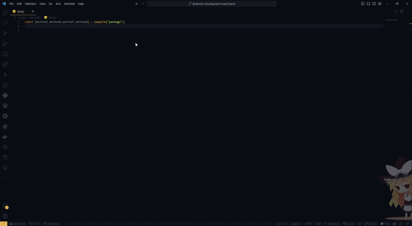

# Beautiful imports README

<p
    align="center"
    style="text-align: center;"
>
    
</p>

## DISCLAIMER

👋 Please pardon me, as this is my first time creating an extension for Visual Studio Code. I have limited knowledge and expertise, so I appreciate your patience.

## Overview

This extension formats JavaScript imports to be more readable.

## Features

- The Beautiful imports extension is designed to improve the readability of JavaScript files by formatting imports.
- In particular, it formats inline imports with more than `3 (default value)` elements to be displayed vertically, making it easier to read and understand the imports in your code.
- Automatic sorting.
- Supports both import and require statements.

## Usage

<p
    align="center"
    style="text-align: center;"
>
    
</p>

- _From this_

```typescript
import {bmethod5 , cmethod6 ,amethod7, method8} from "package";

const {bmethod5 , cmethod6 ,amethod7, method8} =require ("package");
```

- _To this_

```typescript
import {
  amethod5,
  bmethod6,
  cmethod7,
  method8
} from "package";

const {
  amethod5,
  bmethod6,
  cmethod7,
  method8
} = require("package");
```

## Unreleased

- Removes unused imports and sorts the remaining imports alphabetically.
- Formating imports on save.
  
```typescript
//this
import defaultExport, { export1, export2 } from 'module/path';
//and this
import { export1 as alias1, export2 as alias2 } from 'module/path';
//are not included yet
```

## Requirements

- Before installing and using the extension, you must have Node.js and npm (Node Package Manager) installed on your system. You can download the latest version of Node.js from the official website: <https://nodejs.org/en/download/>.

- Additionally, you should have Visual Studio Code version 1.75.0 or later installed. You can download the latest version from the official website: <https://code.visualstudio.com/download>.

## Extension Settings

The extension contributes a command called `extension.formatImports` that can be triggered using the keyboard shortcut `Ctrl+Shift+J` (or `Cmd+Shift+J` on Mac). It also adds a context menu item to the editor that can be used to trigger the same command. The context menu item is available when a `JavaScript` or `TypeScript` file is open in the editor.

For example:

This extension contributes the following settings:

- `beautifulImports.enable`: Enable/disable this extension.

- `beautifulImports.maxInlineImports`: The number of inline imports allowed before they are formatted vertically. Default is 3.

## Known Issues

- ⚠️ This is  just a prototype, it will be replaced or removed sooner.
- In rare cases, formatting may not work correctly if the import statements are not formatted correctly in the first place.
- `Error: Illegal value for 'line'` may be thrown for some reason.

## Release Notes

### 1.0.0

Initial release of Beautiful imports extension.

**Enjoy!** 😄
